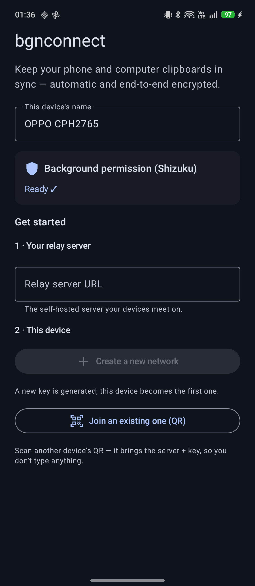
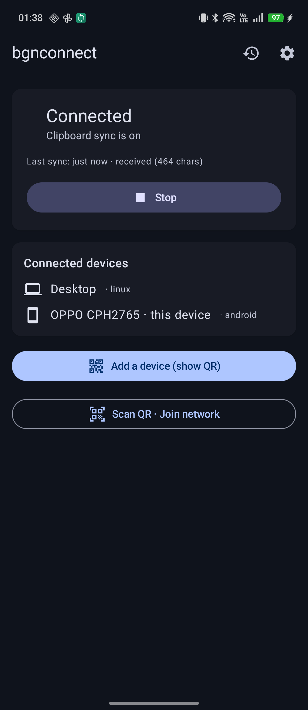
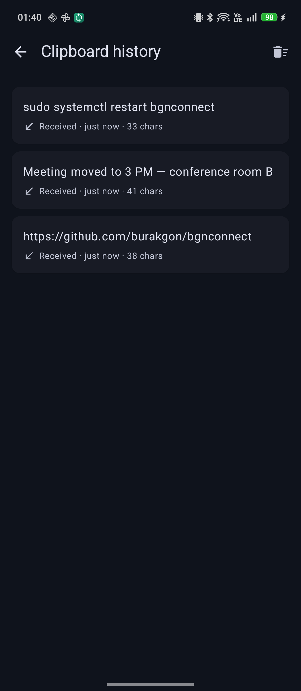

<div align="center">

# 📋 bgnconnect

### Self-hosted, end-to-end encrypted **clipboard sync + direct file transfer** between Android and Linux.

[](LICENSE)
-success)


</div>

bgnconnect does two things between your phone and computer — in real time, end-to-end encrypted, with
**no cloud account and no vendor in the middle**:

- 🔄 **Clipboard sync** — copy a link, an OTP, a paragraph, or an image on one device and it's instantly
  ready to paste on the other.
- 📂 **Direct file transfer** — send any file or photo **straight device-to-device** (full LAN speed);
  the bytes go peer-to-peer and never pass through a server.

The relay that connects your devices is **one you host yourself**.

> **You run your own server.** There is no built-in/default relay — nothing transits anyone else's
> infrastructure. Stand one up in a single command (see [Self-hosting](#-self-hosting)).

## ✨ Features

- 🔄 **Clipboard sync — text *and* images.** Copy here, paste there, automatically (a screenshot on
  your phone is ready to paste on your desktop).
- 📂 **Direct P2P file transfer.** Files stream **device-to-device over WebRTC** — full LAN speed, or
  hole-punched across networks — and the bytes **never touch the relay**. Send from the Android
  **Share sheet** (or a device's send button), or **right-click → "Send with bgnconnect"** on Linux.
- 🔒 **End-to-end encrypted** — AES-256-GCM with a key derived from a secret only your devices know.
- 🕵️ **Zero-knowledge relay** — the server only sees an opaque room id; it can't read your clipboard,
  filenames, or device names, and file bytes never reach it.
- 🔋 **Battery-friendly & event-driven** — no polling. On Android the clipboard is read in the
  background via **Shizuku** (no root); on Linux via `wl-clipboard`.
- 🕘 **History** — recent clipboard items *and* transferred files are kept locally (encrypted); tap a
  clip to re-copy it, or a received file to open it.
- 📷 **QR pairing & multi-device** — share a network by QR; many devices can join the same one.
- 🔁 **Resilient** — auto-reconnects on network changes; survives sleep/roaming.
- 🛡️ **Privacy by default** — clipboard content flagged sensitive (OTP fields, password managers) is skipped.

## 🖼️ Screenshots

<div align="center">

| Onboarding | Home | History |
|:---:|:---:|:---:|
|  |  |  |

</div>

## 🧭 How it works

```
Android (Kotlin / Shizuku)                                   Linux (Go / wl-clipboard)
        │                                                              │
        │── clipboard (tiny E2E frames) ─►  your relay  ◄─ clipboard ──│
        │                                 room = hash(secret)          │
        └────────────  files: direct P2P (WebRTC DataChannel)  ────────┘
   Clipboard frames are AES-256-GCM end-to-end; files stream straight between
   the devices (LAN-direct or hole-punched) and never go through the relay.
```

A **secret** (32 random bytes) defines a sync network. Its hash becomes the `roomId` the relay routes
by; an HKDF of it becomes the AES key your devices encrypt with. The relay is a thin, stateless
pub/sub that never sees the secret — it relays encrypted clipboard frames and the small WebRTC
signaling, while file bytes go peer-to-peer. Full spec: [`proto/PROTOCOL.md`](proto/PROTOCOL.md).

## 🚀 Self-hosting

You need a small box with Docker and a domain (or a Tailscale/WireGuard address). The bundled compose
runs the relay behind **Caddy**, which provisions a Let's Encrypt certificate automatically — so
`wss://` works out of the box.

```bash
git clone https://github.com/burakgon/bgnconnect.git
cd bgnconnect/backend

# Point your domain's DNS at the host, then:
BGN_DOMAIN=relay.yourdomain.com docker compose up -d --build
```

That's it — your relay is live at `wss://relay.yourdomain.com`. Use that URL when you set up the first
device; other devices receive it automatically from the pairing QR.

- **No public domain?** Run it on a Tailscale/WireGuard network and use `ws://<private-ip>:3000`.
- **Cross-network file transfer** works directly via STUN; for the strictest NATs you can point clients
  at your own TURN server (`TURN_URL`/`TURN_SECRET`, see [`backend/README.md`](backend/README.md)).
- **Already running nginx?** See the advanced path in [`backend/README.md`](backend/README.md)
  (`docker-compose.prod.yml` + [`deploy/nginx-relay.conf.example`](backend/deploy/nginx-relay.conf.example)).
- **Verify it:** `bun scripts/relay-check.ts wss://relay.yourdomain.com`.

## 📱 Client setup

**Linux (KDE/Wayland):**
```bash
cd linux
bash install.sh   # builds bgnconnectd → ~/.local/bin, installs the tray app, systemd unit,
                  # and the "Send with bgnconnect" right-click action

bgnconnectd pair <bgnconnect://… | hex> wss://relay.yourdomain.com   # pair to your relay
bgnconnectd qr                                  # show a QR for your phone to scan
systemctl --user enable --now bgnconnect        # start syncing (system tray)
```

**Android:**
1. Install the APK (grab it from [Releases](https://github.com/burakgon/bgnconnect/releases) or build
   it — see [`android/README.md`](android/README.md)) and install **Shizuku**.
2. Open the app → finish the guided Shizuku step.
3. Enter your relay URL and **Create network**, or **Scan QR** from another device.

**Sending files**
- **Android:** **Share → bgnconnect** from any app, or tap the send icon next to a device. Received
  files land in **Downloads** and show in the in-app history (tap to open).
- **Linux:** right-click a file in Dolphin → **"Send with bgnconnect"**, or the tray's **"Send file…"**
  (`bgnconnectd send [--to <device>] <file>…` from the terminal). Received files land in `~/Downloads`
  and the folder opens automatically.

## 🔐 Security model

- The **secret never reaches the relay.** Pairing is offline (QR / `bgnconnect://` link / hex).
- `roomId = base64url(SHA-256(secret))[:32]`; `encKey = HKDF-SHA256(secret, …)`; clipboard payloads are
  **AES-256-GCM** with a fresh random IV each time. A wrong secret fails the GCM tag → rejected.
- **File transfer is peer-to-peer (WebRTC, DTLS-encrypted).** The WebRTC offer/answer is itself sealed
  with your key before it crosses the relay, so the relay can't MITM the connection — and the file
  bytes never reach it.
- The relay stores only the last encrypted clipboard frame per room (reconnect catch-up) and short-lived
  encrypted blobs for clipboard *images* (room-scoped, ~30 min TTL). It can decrypt none of it.
- Cross-language crypto is pinned by [`proto/crypto-test-vectors.json`](proto/crypto-test-vectors.json).

## 🛠️ Build from source

| Component | Stack | Build |
|-----------|-------|-------|
| `backend/` | Bun + Hono + SQLite | `bun install && bun test` · `docker compose up -d --build` |
| `linux/`   | Go (+ `wl-clipboard`, pion/webrtc) | `go build ./... && go test ./...` |
| `android/` | Kotlin + Compose + Shizuku + WebRTC | `bash scripts/build-apk.sh` (hermetic Docker build) |

## 📄 License

Copyright 2026 burakgon — licensed under [Apache-2.0](LICENSE). The reflective `IClipboard` access
pattern on Android is inspired by [scrcpy](https://github.com/Genymobile/scrcpy) (Apache-2.0).
